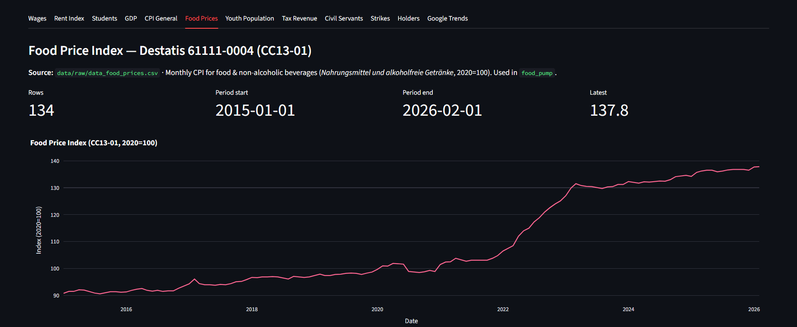
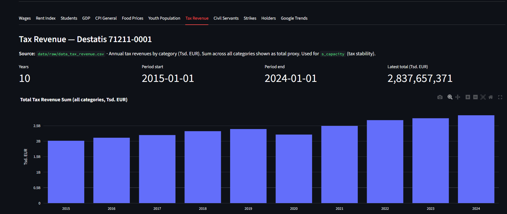
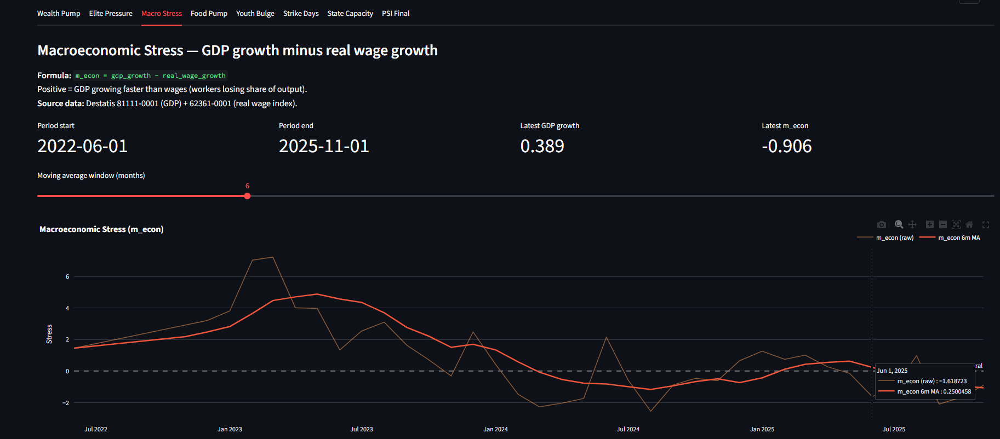

# Cliodynamics: Political Stress Index (PSI) for Germany

[](https://www.python.org/)
[](https://peterturchin.com/cliodynamics/)
[](LICENSE)

This repository applies Structural-Demographic Theory (SDT) to modern Germany and builds a reproducible Political Stress Index (PSI) pipeline from federal statistics, strike data, and mobilization proxies.

The current project state is ahead of the original README: the repository already contains a working end-to-end pipeline, processed datasets, a Plotly HTML dashboard, and a Streamlit explorer for both raw and processed data.

---

## Overview

The project estimates structural political stress by combining six interacting blocks:

- `wealth_pump`: pressure from rent and price growth relative to wages
- `elite_pressure`: elite overproduction adjusted by estimated available elite openings
- `m_econ`: macroeconomic stress via GDP growth and real wage deterioration
- `food_pump`: food inflation relative to general CPI
- `youth_bulge`: relative youth share in the population
- `strike_days`: annual labor conflict intensity
- `s_capacity`: state capacity via tax stability and civil servant staffing

The current final series is stored in `data/processed/master_cliodynamics_final.csv`.

---

## PSI Formula

The current implementation in `src/preprocessors/process_final_psi.py` computes:

$$
\mathrm{psi} =
\mathrm{rolling\_mean}_{12}
\left(
\frac{
\mathrm{nm}(wealth\_pump)
\cdot elite\_pressure
\cdot \mathrm{nm}(m\_econ)
\cdot \mathrm{nm}(food\_pump)
\cdot \mathrm{nm}(youth\_bulge)
\cdot \mathrm{nm}(strike\_days)
}{
s\_capacity
}
\right)
$$

where:

- `elite_pressure = nm(elite_candidates) * (1 + frustrated_fraction)`
- `frustrated_fraction = clip((annual_graduates - annual_openings) / annual_graduates, 0, 1)`
- `annual_graduates = elite_candidates * 0.70 / 5`
- `annual_openings = holders * 0.05`
- `s_capacity = tax_stability * civil_servant_factor`

`nm(...)` is the repository's internal min-max style normalization helper used to keep factors comparable.

---

## Repository Layout

```text
src/
  loaders/         Raw data ingestion from Destatis and Google Trends
  preprocessors/   Intermediate and final PSI dataset construction
  analysis/        HTML dashboard, Streamlit app, and helper analysis scripts
data/
  raw/             Downloaded source tables and curated CSV inputs
  processed/       master_cliodynamics*.csv outputs
output/            Exported charts and dashboards
```

Key scripts:

- `src/loaders/load_rent_and_wages.py`
- `src/loaders/load_students.py`
- `src/loaders/load_studienanfaenger.py`
- `src/loaders/load_economic_indicators.py`
- `src/loaders/load_google_trends.py`
- `src/preprocessors/process_base_wages.py`
- `src/preprocessors/process_students.py`
- `src/preprocessors/process_final_psi.py`
- `src/analysis/generate_dashboard.py`
- `src/analysis/dashboard.py`

---

## Data Sources

- Destatis GENESIS API: wages, CPI, GDP, tax revenue, demographics, higher education, civil servants, holders proxy
- WSI strike data: annual lost working days
- Google Trends: mobilization proxy for recent periods
- Curated manual CSVs in `data/raw/` for strike and holders series where needed

Relevant raw files currently present include:

- `data/raw/data_students.csv`
- `data/raw/data_studienanfaenger.csv`
- `data/raw/data_tax_revenue.csv`
- `data/raw/data_civil_servants.csv`
- `data/raw/data_holders.csv`
- `data/raw/data_holders_raw.csv`
- `data/raw/data_strikes_wsi.csv`
- `data/raw/google_trends_mobilization.csv`

---

## Installation

### Prerequisites

- Python 3.9+
- Destatis GENESIS credentials

### Install dependencies

```bash
pip install -r requirements.txt
```

Current `requirements.txt` includes:

- `pandas`
- `numpy`
- `plotly`
- `matplotlib`
- `statsmodels`
- `requests`
- `python-dotenv`
- `pytrends`

If you want to use the Streamlit dashboard, install it separately:

```bash
pip install streamlit
```

### Environment variables

Create `.env` in the repository root:

```env
DESTATIS_USER=your_username
DESTATIS_PASSWORD=your_password
```

---

## Pipeline Execution

Run the project in three stages.

### 1. Load raw data

```bash
python src/loaders/load_rent_and_wages.py
python src/loaders/load_students.py
python src/loaders/load_studienanfaenger.py
python src/loaders/load_economic_indicators.py
python src/loaders/load_google_trends.py
python src/analysis/merge_trends.py
```

### 2. Build processed datasets

```bash
python src/preprocessors/process_base_wages.py
python src/preprocessors/process_students.py
python src/preprocessors/process_final_psi.py
```

Main outputs:

- `data/processed/master_cliodynamics_v2.csv`
- `data/processed/master_cliodynamics_v3.csv`
- `data/processed/master_cliodynamics_final.csv`

### 3. Generate visual outputs

Static/HTML dashboard:

```bash
python src/analysis/generate_dashboard.py
```

Streamlit explorer:

```bash
streamlit run src/analysis/dashboard.py
```

---

## Current Outputs

The repository already contains generated artifacts in `output/`:

- `output/psi_dashboard.html`: main interactive Plotly dashboard
- `output/psi_dashboard.png`: exported dashboard image
- `output/cliodynamics_plot.png`: earlier static visualization
- `output/seasonal_decomposition.png`
- `output/wealth_pump_trend.png`

### Charts





The Plotly dashboard includes:

- historical PSI
- factor panels for mobilization, elite pressure, macro stress, youth bulge, and state capacity
- studentflow / elite pipeline panel
- forecast through `2027-12`

---

## License

This project is licensed under the MIT License. See [LICENSE](LICENSE).
